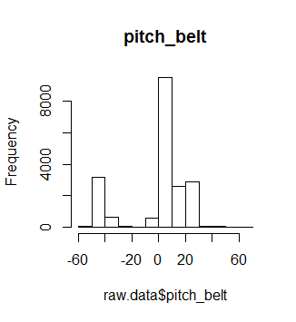

# Multi-Class Classification Problem
Andriy Fedorenko  
Friday, February 16, 2015  


##Introduction

<p style='text-align: justify;'> 
The data were collected from accelerometers on the belt, forearm, arm, and dumbell of 6 participants who were asked to perform barbell lifts correctly and incorrectly in 5 different ways.The goal of this project is to test different statistical approaches on the dataset, find the best conditions for data prediction based on test error estimates for multi-class classification problem and predict the manner in which volunteers did the exercises. This is the "classe" variable in the training set. The report describs how the model was build, how a cross validation was used, how many parameters needed to get minimum test error. The model also predicts 20 different test cases. More information is available from the website here:
http://groupware.les.inf.puc-rio.br/har (see the section on the Weight Lifting Exercise Dataset)

The training data for this project are available here:

https://d396qusza40orc.cloudfront.net/predmachlearn/pml-training.csv

The test data are available here:

https://d396qusza40orc.cloudfront.net/predmachlearn/pml-testing.csv</p>

##Solution: 

<p style='text-align: justify;'> 

```r
dim(raw.data)
```

```
## [1] 19622   160
```
</p>

<p style='text-align: justify;'> 
The quality of work-out in each exercise was tested based on 159 parameters and 19622 experimental cases (or samples) and there are five different categories that can be assigned to each case depending on how well exercise was performed by a volunteer. To solve such multi-class classification problem, I used generalized linear model to predict the accuracy test error for the dataset. Before we can start modeling, let's take a look at our data.</p>

##Data Cleaning:

<p style='text-align: justify;'> 
From the tables below we can find that data frame in the training set contains a raw data. For instance, $var_yaw_arm variable has more than 80 present of NAs.</p>

```
##  num [1:19622] NA NA NA NA NA NA NA NA NA NA ...
```
<p style='text-align: justify;'> 
Some of the variables, like $pitch_belt or $yaw_arm, have very high standard deviation compares to the mean value, suggesting that most of the values of such variables are small, but there are few that are much larger. The distribution, in this case, is skewed and the tested model may not converge properly on this dataset.  
</p>


```
##            X.mean.values. X.sd.values.
## pitch_belt      0.3052828     22.35124
## yaw_arm        -0.6187514     71.36338
```

  
<p style='text-align: justify;'> 
Also, the variables have different types so that in order for gml model to converge and predict testing set reliably, all raw data variables have to be standardized.</p>


```
## 'data.frame':	19622 obs. of  4 variables:
##  $ total_accel_belt : int  3 3 3 3 3 3 3 3 3 3 ...
##  $ new_window       : chr  "no" "no" "no" "no" ...
##  $ pitch_belt       : num  8.07 8.07 8.07 8.05 8.07 8.06 8.09 8.13 8.16 8.17 ...
##  $ kurtosis_yaw_belt: logi  NA NA NA NA NA NA ...
```


<p style='text-align: justify;'>
In order to standardize the variables, the raw data were preprocessed with data.cleaning() and my.dummy.variable() functions that performed following procedures:

* removed variables containing more than 80% of NA's 
* removed Near Zero-Variance predictors 
* made all cases complete 
* removed all character and date variables 
* made all left variables as numeric
* made the outcome variable as a factor 
* scale and center all variables 
* created a dummy variables from outcome, where each dummy variable corresponds to one of the categories of multi-class vector, such as "A", "B",.,"E".</p>

<p style='text-align: justify;'>
The final preprocessed data is the list of 56 numerical variables and 5 dummy variables corresponding to each of five categories "A", "B",.,"E". </p>

```
##                Length Class      Mode
## Num.data       56     data.frame list
## DummyVariables  5     data.frame list
```

##Results:
## Tuning the number of samples of the tidy data.
<p style='text-align: justify;'> 
 To predict twenty samples of the test set, we need first of all to optimize the parameters of glm model and find out optimal conditions which we will use for our prediction. We could fit the model to the available preprocessed data, choose a set of parameters of the model that will correspond to the minimum of accuracy error (or misclassified samples) and predict the final outcome of the test set using these parameters. But this method would have suffered a high bias since the model may fit well on preprocessed data but may fail to fit new set of data that were not present in fit dataset. The main goal is to predict how well the model will fit the new, unseen data set. To investigate the accuracy error of the model on unseen data, the better strategy would be to split the preprocessed data into at least two separate parts, fit the model to the first part and then using received parameters to find the minimum of the accuracy error on the second part of the data. This approach will give us the clearer picture as to how well the glm model will behave on new data. To implement such approach, I partitioned the preprocessed data into two separate parts (training and testing sets) and investigated the behavior of both train and test errors as the function of the percentage of data that goes to training set.</p>


 
<p style='text-align: justify;'> 
It is clear from the figure that the model tends to overfit the training data when fewer samples are used in training set (red line) and that the test error has much more bias having the accuracy error near 0.55 (blue line). The more training data we use to adjust the model parameters the less test error we can observe. When above 20-25% of preprocessed data are used in the training set the test error reaches saturation at 0.045 (or 4.5%), so getting more training data will not help much to improve test error. Thus, more than 4000 samples should be used to train the glm model and to reliably predict a new data set with 4.5% of accuracy error or 95.5% of accuracy.</p>

##K-Fold Cross-Validation:
<p style='text-align: justify;'> 
We can also divide the set of samples into k groups or folds of equal size. The first fold is treated as a test set, and the model is fit on the remaining k-1 folds. The accuracy error is then computed on the observations in the held-out fold. This procedure is repeated k times; each time, a different group of observations is treated as a training set. This process results in k estimates of the test error and the final error estimate is computed by averaging these k values. 


 
<p style='text-align: justify;'> How many K-folds needed to reliably predict the accuracy of the test error? I have investigated the averaged test error depending on a set of K-folds in range from 2 to 10 for a different numbers of the samples: 500,1000, 5000 and15000 samples.The test error for 500 samples suffers from high variance since the model overfitted the training set and have the largest test error among all tested samples. 1000 sample case is still suffering from high variance. The test error is less than in 500 sample case and reached some saturation at 5%.Using 5000 samples improved the test error significantly and reaches some saturation around 0.0473 (blue line). This case reveals low variance and low bias, suggesting that 5000 samples are sufficient enough to reliable estimate test error and use this amount of samples to predict a new data set. Using almost all available data samples gives the same test errors with near the same value of a minimum, around 0.0470 (or 4.7%), but it takes more time to train the model. Another interesting observation is that K-folds cross-validation works well with a small amount of data. For example, if an experimental data are short of samples then K=10 does much better job compare to K=5 for 500 sample case and it will improve the final outcome of this case with a given model. The conclusion is that to achieve good test error one should use more than 5000 samples with more or equal K>=5.</p>

##Correlation and Principal Component Analysis: 
<p style='text-align: justify;'> 
Having analysed the summary of glm model, we can find that there are some coefficients that have high p-value, high enough to consider them as not significant, suggesting that some variables may be correlated.</p>

```
FALSE                      Estimate Std. Error     z value  Pr(>|z|)
FALSE magnet_belt_y     0.021779106 0.09877161  0.22049966 0.8254820
FALSE pitch_arm        -0.009501871 0.05868574 -0.16191108 0.8713759
FALSE gyros_arm_y      -0.010131303 0.13670013 -0.07411334 0.9409202
FALSE accel_dumbbell_z  0.021837506 0.31299806  0.06976882 0.9443777
```
<p style='text-align: justify;'> 
If there is a correlation among variables, then the estimated accuracy error on test set will tend to overestimate the true test errors. Indeed, the analysis of correlated variables shows that there are 7 pairs of positively correlated variables with correlation coefficients more than 0.9.</p>

```
##                  row col
## roll_belt          5   7
## roll_belt          5   8
## yaw_belt           7   8
## roll_belt          5  13
## yaw_belt           7  13
## total_accel_belt   8  13
## gyros_dumbbell_z  37  50
```
<p style='text-align: justify;'> To reduce the influence of correlation among variables the Principal Component Analysis was used. This approach allows to convert a set of samples of linearly correlated variables into a principal components (or variables) that are linearly uncorrelated.There are 27 principal components that are required to cover 95% of the variance in the data. The results show that accuracy test error of our model became higher when using principal components compare with control (blue vs red line).</p>
 
<p style='text-align: justify;'> Digging deeply into the data, we can find that, the variables "roll_belt" (5), "yaw_belt"(7), "total_accel_belt"(8), "gyros_dumbbell_z"(13), "accel_belt_y"(40) and  "gyros_forearm_z"(53) are all correlated with each and can be rearranged into a group of correlated variables so that their data points overlap on the graph (left and right panels). And we can see from the figure below, that even those parameters are correlated, the correlation is not subjected to the linear relation (green and red data points, right panel), but rather can be approximated by a higher degree polynomial function.Removal of correlated variables slightly increased the final test error from 4.7% to 6.0 % (green line, figure above). </p>
 

##Conclusions: 

<p style='text-align: justify;'> Based on the performed investigation, we can make conclusions that in order to solve multi-class logistic regression problem and reliably predict a new data set using proposed generalized linear  model (glm) we should train the model on no less than 5000 observations (samples), with K-folds equal more than 5 folds. The analysis shows that there are 7 pairs of  correlated variables that may overestimate the final accuracy test error. It would be also reasonable to remove correlated variables or adjust the linear formula model by replacing the linear sum of correlated variables with higher degree polynomial function. Principal component analysis can be performed at the expense of  the higher test error and it would be reasonable to use only for the sake of faster performance.</p>


##Predictions:
<p style='text-align: justify;'> 
Predictions made on 20 samples dataset gave the following values: 
.</p>


```
FALSE  [1] "C" "A" "A" "A" "A" "A" "A" "B" "D" "C" "D" "C" "D" "B" "D" "D" "E"
FALSE [18] "E" "E" "E"
```

